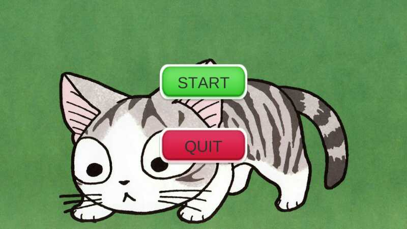
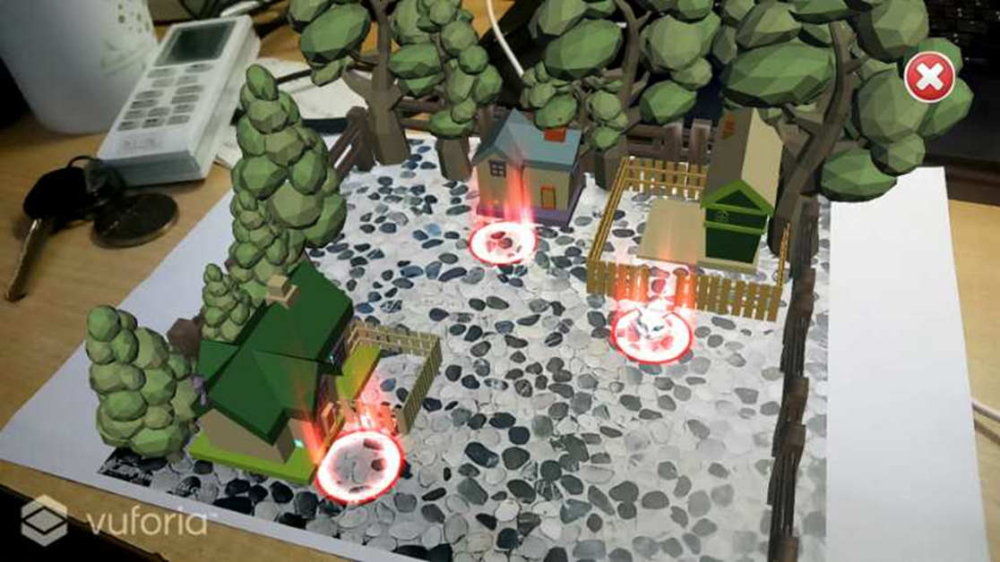

# 游戏名称

ARcatcat养猫游戏

# 游戏简介

## 游戏背景

通过AR的技术实验虚拟养猫技术，不用花费精力和钱就能同样获得养猫的乐趣

## 游戏操作

* 打开游戏的时候是一个开始界面，可以通过界面上按钮进入游戏。

* 进入游戏之后，界面就是基于现实场景产生的AR场景，有一个花园，有三个光圈在三个房子门前。小猫在花园的正中间。

* 通过在现实场景中用手指点击场景位置即可控制小猫的移动。在游戏的过程中，可以给小猫喂食，猫粮可以在商店中购买。

* 进入右上方的房子后，里面是个木屋。小猫可以在木屋中走动。

* 进入左上方的房子后，里面是一个圣诞小房子。点击地板走到圣诞小姐姐身边，就弹出对话框，进入抛球小游戏。

* 进入左上方的房子后，里面是一个鬼屋。进入鬼屋之后，可以进行抓老鼠小游戏。

* 不想玩的时候，除了系统级别的暴力杀死程序外，有退出游戏的按钮。

# gif动画

# 3分钟视频网址

[挤需体验三番钟](https://v.youku.com/v_show/id_XMzY4OTc4OTg1Ng==.html)

# 游戏亮点

1. 应用了AR技术在传统养猫游戏上，能基于现实场景产生AR场景，并让猫在AR场景下活动
2. 小猫能进入不同场景活动，并且不同场景之间能够自由切换
3. 在活动的过程中，小猫能够自动规避场景中的障碍物
4. 好玩
5. 好玩

# 团队简介

* 何嘉敏、胡浚楠：负责编辑代码和代码的优化
* 侯潇芮、洪韵宜：负责场景的搭建和模型优化
* 朱明杰：负责游戏的测试和优化

# 游戏设计文档链接

TODO

# 游戏下载链接

[苏喂苏喂](https://www.kuaishou.com/)