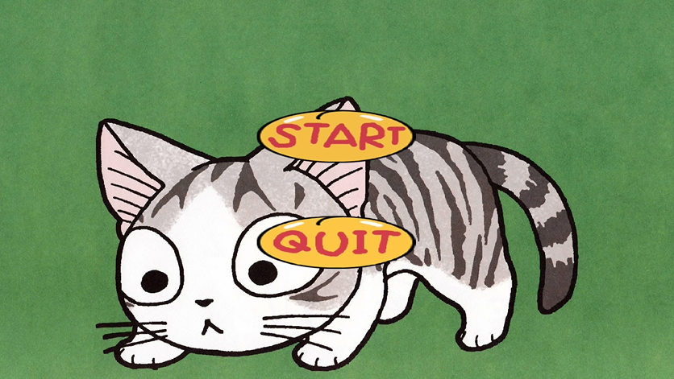
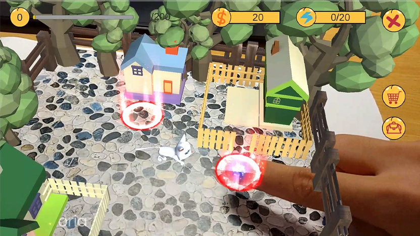
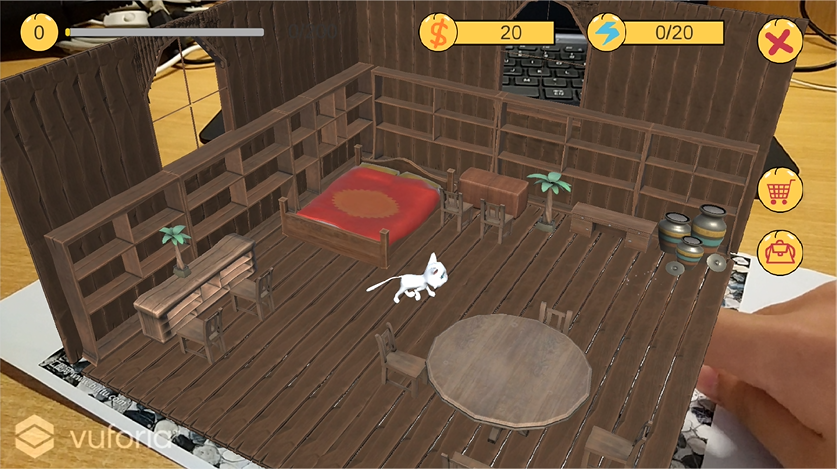
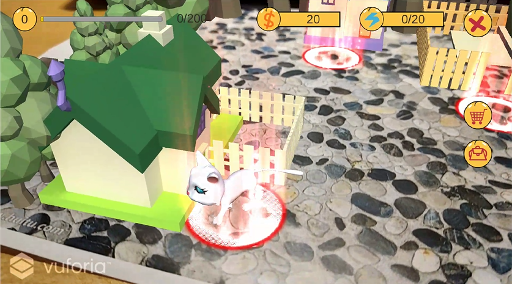
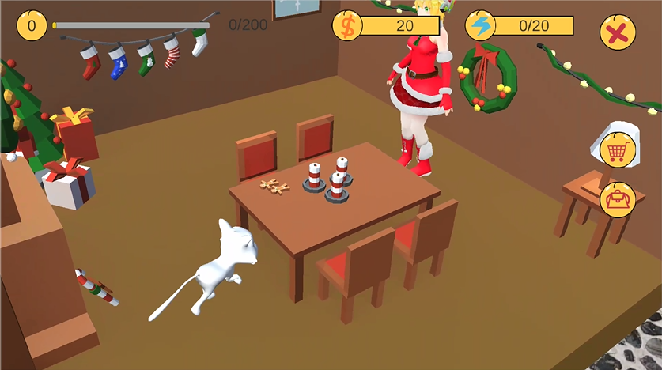
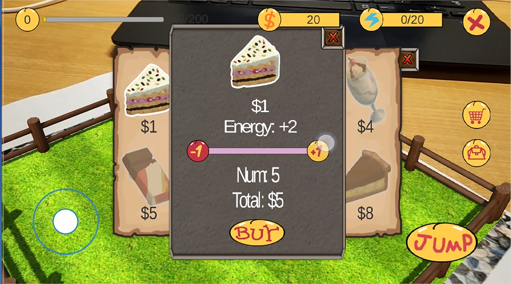
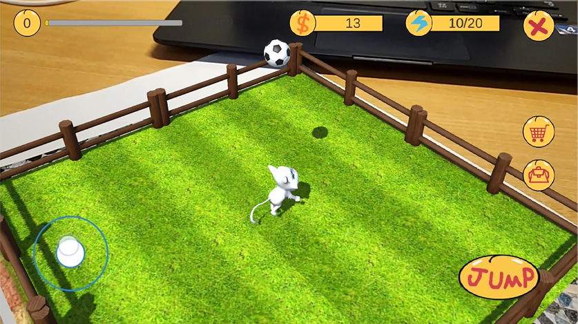
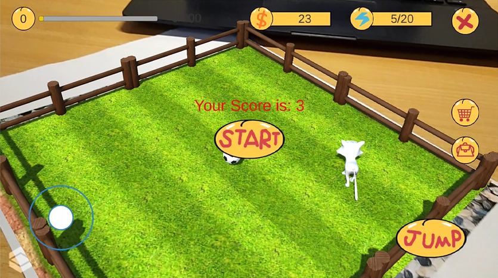
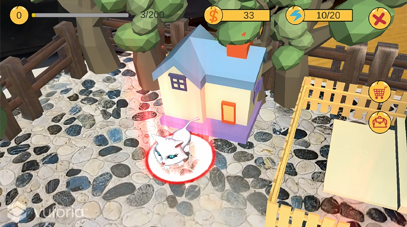
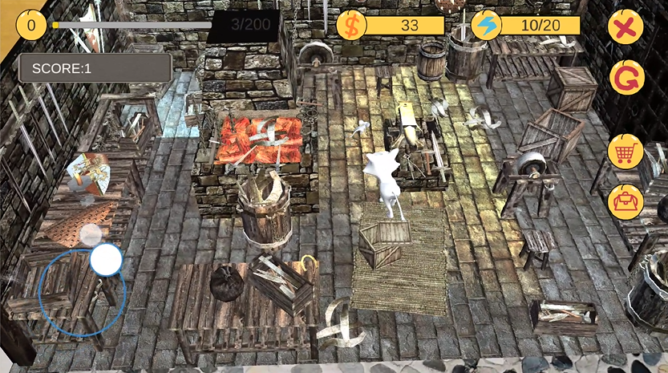

# 游戏名称

ARcat养猫游戏

# 游戏简介

## 游戏背景

通过AR的技术实验虚拟养猫技术，不用花费精力和钱就能同样获得养猫的乐趣

## 游戏操作

* 打开游戏的时候是一个绿色养眼的界面，可以通过界面上的START按钮进入游戏。

* 游戏画布按钮功能：

* 进入游戏之后，扫描特定的鹅卵石图片，出现花园模型。花园中分别有三个传送门（红色光圈）在三个房子门前。小猫在花园的正中间。玩家透过手机屏幕观察，用手触摸光圈的位置，小猫可以进入到对应的房子里面。

* 小猫进入到一个可以随意走动的复古木屋，用手点击现实图片，屏幕中的小猫会走向你点击到的地方。

* 小猫进入另一个房子

* 进入房子后，里面是个圣诞小屋，还有一个圣诞小姐姐。小猫可以在圣诞小屋中走动。让小猫走到圣诞小姐姐附近，小姐姐会让小猫开启playball小游戏。

* 进入到playball小游戏，提示能量不足，所以先去商店购买写猫粮，去背包使用猫粮，得到精力才能玩游戏哦。每次游戏会消耗5点精力，每次游戏会奖励金钱，并根据游戏成绩升经验值。

* playball小游戏的场景一个小草坪，玩家可以操控左下角的方向盘控制小猫接球，控制右下角JUMP让小猫跳跃。准备好就可以START啦。

* 如果没有接到球，就游戏结束了。

* 小猫进入最后一个房子————刺激的鬼屋！

* 这个鬼屋很神秘，这次玩家扮演一只在鬼屋被猫追的小老鼠（小白鼠），玩家控制左下角方向移动老鼠，猫会追着老鼠。玩家被猫抓到游戏结束。

* 不想玩的时候，除了系统级别的暴力杀死程序外，QUIT是退出游戏的按钮。

# gif动画

以下是游戏过程的一些gif

# 3分钟视频网址

[挤需体验三番钟](https://v.youku.com/v_show/id_XMzY5MzgyNTEwMA==.html?spm=a2h3j.8428770.3416059.1)

# 游戏亮点

1. 应用了AR技术在传统养猫游戏上，基于现实图片产生AR场景，并让猫在AR场景下活动。
2. 小猫能进入不同场景活动，并且不同场景之间能够自由切换，场景内容丰富多彩。
3. 使用了unity寻路导航功能，在活动的过程中，小猫能够自动规避场景中的障碍物。
4. 使用了AR的虚拟按钮组件开发，增加人机交互元素，让玩家更具有乐趣。
5. 轻快游戏BMG，体验更佳，让游戏充满节奏感和现代感。
6. 游戏机制灵活，玩家与猫互动需要精力，精力来自于猫粮，猫粮要用钱买，玩游戏奖励钱和经验。

# 团队简介

* 何嘉敏、胡浚楠：负责编辑代码和代码的优化
* 侯潇芮、洪韵宜：负责场景的搭建和模型优化
* 朱明杰：负责游戏的测试和优化

# 游戏设计文档链接

[设计文档点我](https://github.com/ARcatcat/ARcatcat.github.io/blob/master/%E6%B8%B8%E6%88%8F%E7%AD%96%E5%88%92%E6%96%87%E6%A1%A3.docx)

# 游戏下载链接

[安卓下载点我](https://pan.baidu.com/s/1KUbZ_j2VzMf0wE-jRxNbDg)
